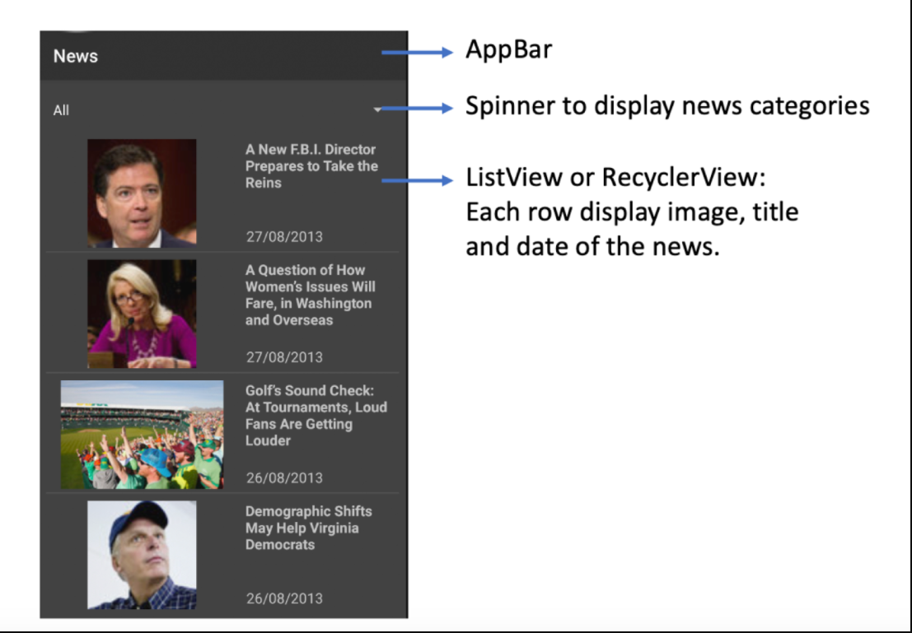
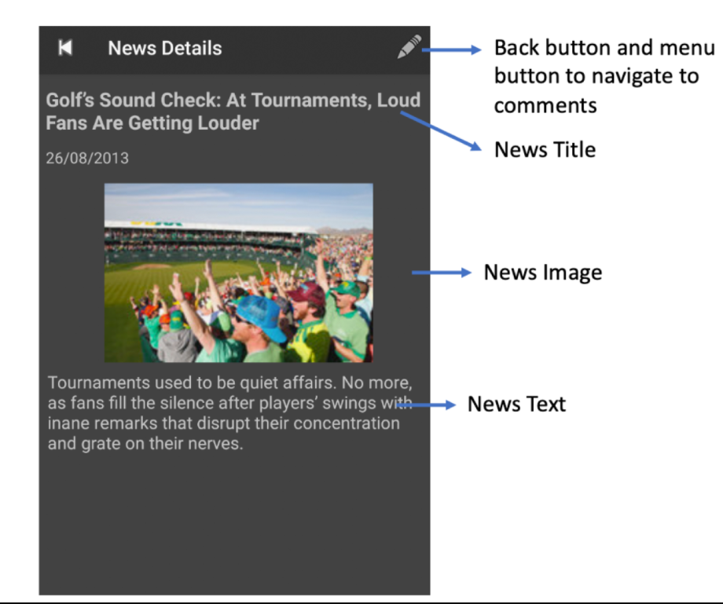
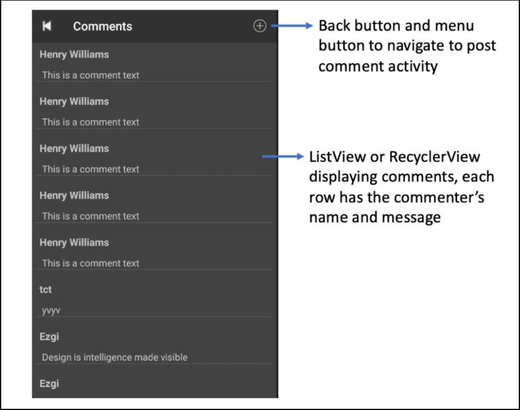
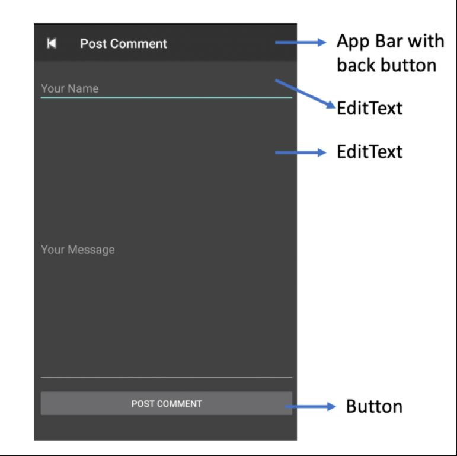

# news-app-android
Online news application for Android.

Final project for Mobile Development Course in Spring 2019-2020. 

- Used restful web service to fetch data(news and comments) and post data(posting comment).

### Screenshots:

  
   

  

  
  

